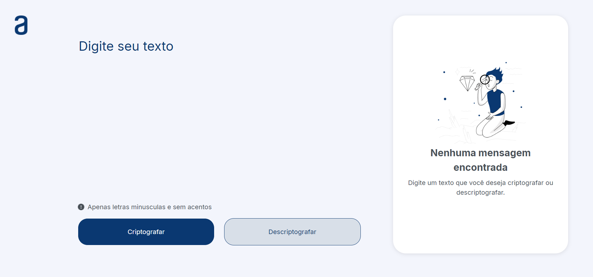

# Encryptor - Challenger T7 ONE

- This project was created as the final challenge of the basic module of One Next Education course, by Alura and Oracle.
- It represents a simple encryptor based on some simple rules to practive HTML, CSS and Javascript concepts.

<div>
    <p align="center">
         
    </p>
</div>

## Encryption Keys

to encrypt, the site changes the vowels for some sequences of cosoants like:

- "e" to "enter"
- "i" to "imes"
- "a" to "ai"
- "o" to "ober"
- "u" to "ufat"

## Some exemples

- cat becomes cait
- apples becomes aipplenters

## Limitations

- Only lowercase letters and no accents

## Tecnologies used

<div style="display: inline_block">
    
    
    
</div>

## How to use

1. First, clone our repository in your computer as follows

 ```bash
 git clone git@github.com:joas-barros/ONE_Encryptor.git
```
2. Then, change your directory to the project's

 ```bash
 cd ONE_Encryptor
```
3. Open the index.html file in your favorite browser

4. Write the mensege you wish to encrypt/decrypt in the text field

5. You can either encrypt and decrypt by pressing the buttons

6. The result menssege will be shown in the right side.

7. You can copy the result and use it whatever you want.

## How to colaborate

- Feel free to colaborate! Follow the next steps:

1. Fork the repository in your profile
2. Create your branch (git checkout -b my-branch)
3. Commit your changes (git commit -m "my changes")
4. Send your changes to your GitHub repository (git push origin my-branch)
5. Open a Pull Request
